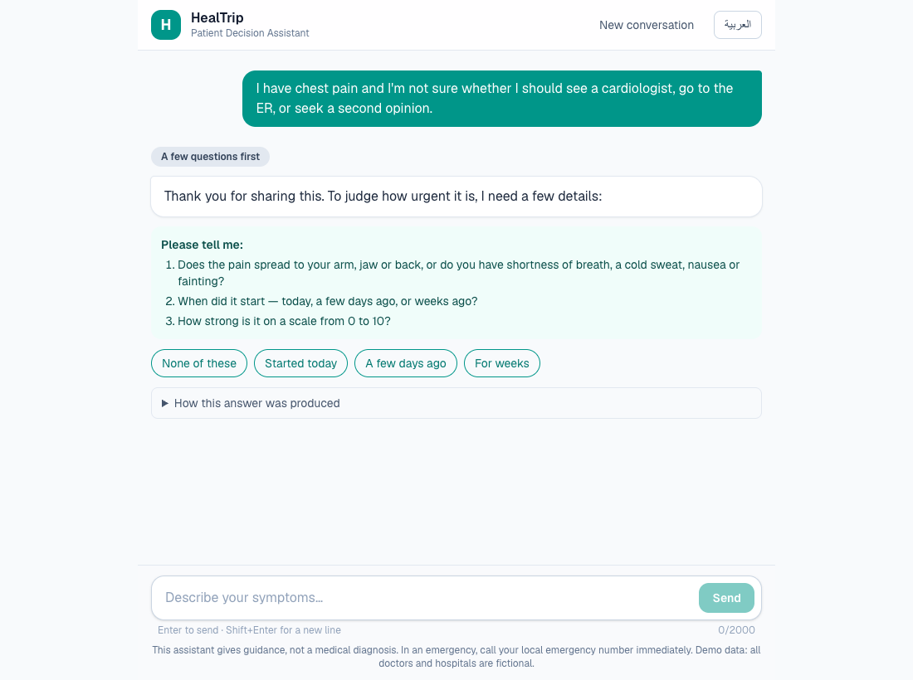
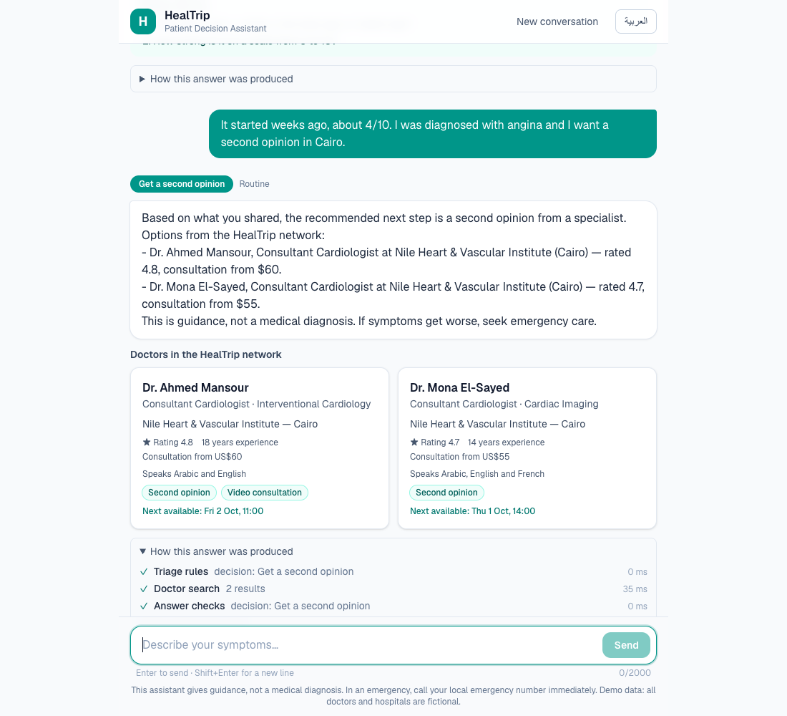
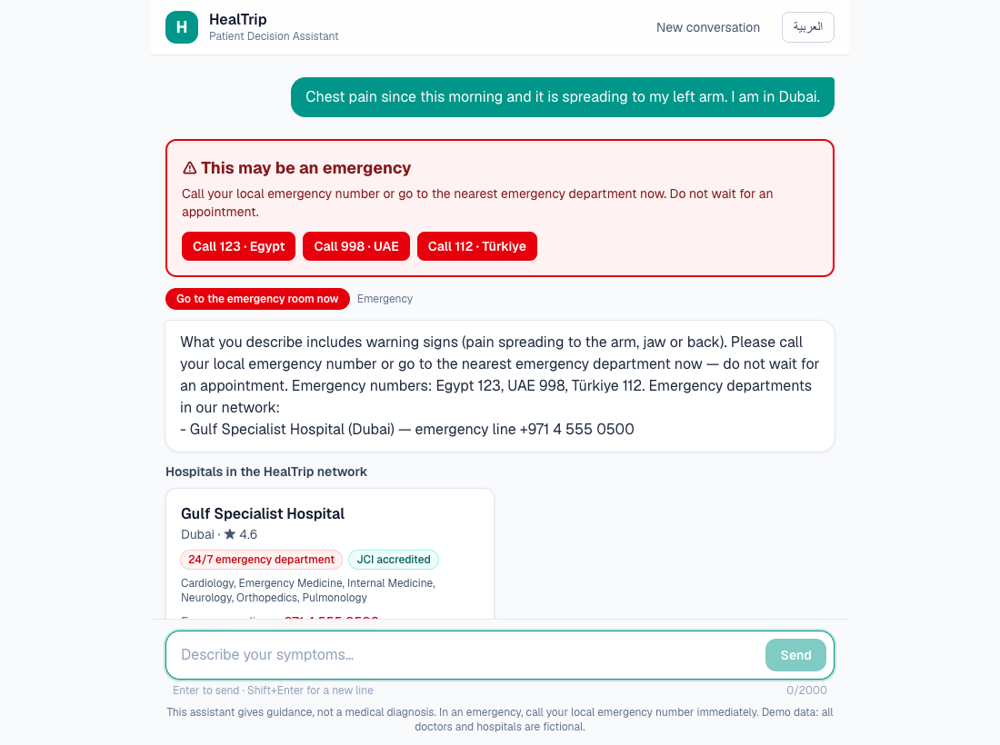
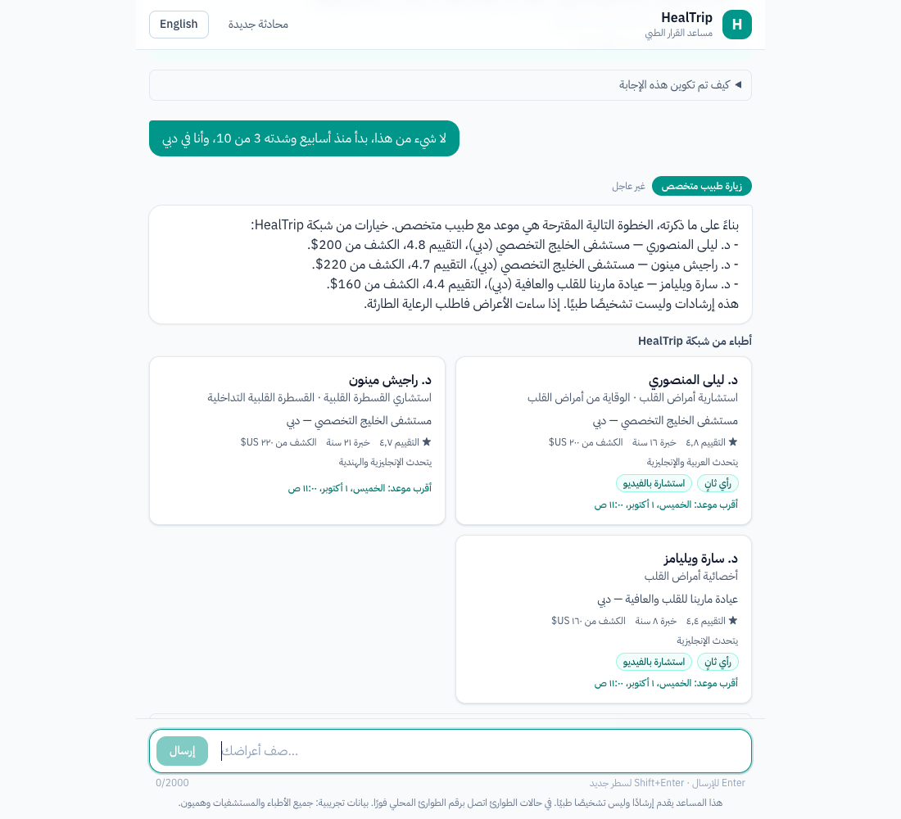
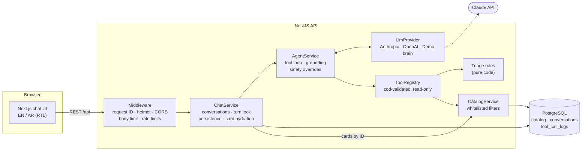
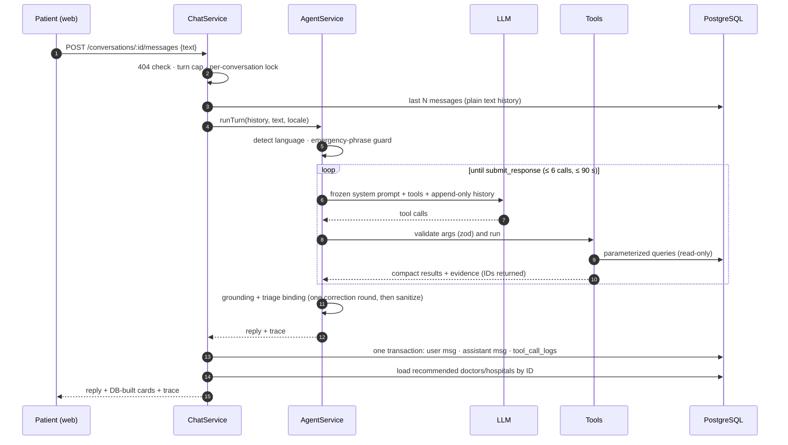

# HealTrip AI Patient Decision Assistant

A prototype assistant that helps a patient decide the right next step — **emergency care now, same-day
care, a specialist, a second opinion, or a GP** — and shows suitable options from the HealTrip network
of doctors and hospitals, in **English and Arabic**.

It is built to show _how_ the system is engineered: a tool-calling AI agent whose medical urgency is
decided by code, whose recommendations are checked against the database before a patient sees them,
and which fails safely.

**Live demo:** _added after deployment_ · **Stack:** NestJS · Next.js · PostgreSQL (Prisma) · Claude (provider-agnostic)

<p>
  
  
</p>
<p>
  
  
</p>

---

<div dir="rtl">

## ملخص بالعربية

نموذج أولي لمساعد يساعد المريض على اختيار الخطوة التالية الصحيحة: الطوارئ فورًا، أو تقييم في نفس اليوم، أو طبيب متخصص، أو رأي طبي ثانٍ — مع ترشيح أطباء ومستشفيات **من قاعدة بيانات HealTrip فقط**، وبالعربية والإنجليزية (مع دعم كامل للكتابة من اليمين لليسار).

- **الـAI Agent** يفهم الحالة، ويطرح أسئلة توضيحية، ويستخدم أدوات (Tools) للبحث في قاعدة البيانات بدل التخمين.
- **درجة الخطورة يقررها الكود وليس الـAI**: قواعد فرز طبي ثابتة ومختبرة، والـAI لا يستطيع تخفيض حالة طارئة.
- **منع اختلاق المعلومات**: الـAI يشير للأطباء بالـID فقط، وكل ID يُرفض إن لم يأتِ من نتيجة أداة في نفس المحادثة، وأي اسم طبيب غير موجود في النص يُحذف، والكروت تُبنى من قاعدة البيانات مباشرة.
- **الأمان والأخطاء**: تحقق من كل المدخلات، حدود للطلبات، سجلات بدون بيانات المريض، سجل تدقيق لكل أداة، وعند أي عطل يحصل المريض على رد آمن (وإرشاد طوارئ إن كانت الحالة قد تكون طارئة).
- **الاختبارات**: أكثر من 300 اختبار، منها مجموعة "نموذج يتصرف بشكل خاطئ عمدًا" تثبت أن البيانات المختلقة لا تصل للمريض، بالإضافة إلى تقييمات (Evals) للـAgent و CI.
- يعمل بدون مفتاح API عبر "Demo brain" محلي، ويعمل مع Claude بتغيير متغير بيئة واحد.

</div>

---

## Contents

1. [What it does](#what-it-does)
2. [Quick start](#quick-start)
3. [Architecture](#architecture)
4. [AI agent design](#ai-agent-design)
5. [How the AI is prevented from inventing data](#how-the-ai-is-prevented-from-inventing-data)
6. [Safety](#safety)
7. [API](#api)
8. [Data model](#data-model)
9. [Security](#security)
10. [Error handling & resilience](#error-handling--resilience)
11. [Testing & quality](#testing--quality)
12. [Key decisions & trade-offs](#key-decisions--trade-offs)
13. [Assumptions, limitations & future work](#assumptions-limitations--future-work)
14. [Configuration](#configuration)

Deep dives: [docs/agent.md](docs/agent.md) · [docs/decisions.md](docs/decisions.md) · [docs/database.md](docs/database.md) · [docs/deployment.md](docs/deployment.md)

---

## What it does

The example from the brief, end to end:

> **Patient:** I have chest pain and I'm not sure whether I should see a cardiologist, go to the ER, or seek a second opinion.
>
> **Assistant** _(next step: a few questions first)_: To judge how urgent it is — does the pain spread to your arm, jaw or back, or do you have shortness of breath, a cold sweat, nausea or fainting? When did it start? How strong is it (0–10)? `[None of these] [Started today] [A few days ago] [For weeks]`

Then, depending on the answers:

| Patient says                                                                     | Decided by the triage rules   | What the patient sees                                                                                |
| -------------------------------------------------------------------------------- | ----------------------------- | ---------------------------------------------------------------------------------------------------- |
| "…it's spreading to my left arm, I'm in Dubai"                                   | `ER_NOW` (red flag)           | Emergency banner with tap-to-call numbers, Dubai's emergency department — **no appointment booking** |
| "None of these, for weeks, 4/10, diagnosed with angina, second opinion in Cairo" | `SECOND_OPINION` (cardiology) | Cairo cardiologists who offer second opinions, as cards built from the database                      |
| "None of these, started today, 5/10, I'm 55 and smoke"                           | `URGENT_CARE`                 | Same-day assessment advice                                                                           |

Every answer has a collapsible **"How this answer was produced"** panel (tools called, triage decision,
whether safety checks corrected the answer) and a persistent "guidance, not a diagnosis" disclaimer.

## Quick start

Requirements: **Node 22+** and **pnpm 11**. No Docker, no API key needed.

```bash
pnpm install
cp apps/api/.env.example apps/api/.env          # defaults: local DB + offline demo brain

pnpm --filter @healtrip/api db:local            # local PostgreSQL (Prisma dev server, no Docker)
pnpm --filter @healtrip/api db:migrate          # apply the schema
pnpm --filter @healtrip/api db:seed             # load the (fictional) catalog

pnpm dev                                        # API → http://localhost:4000/api · Web → http://localhost:3000
```

**Use Claude instead of the demo brain:** in `apps/api/.env` set `LLM_PROVIDER=anthropic` and
`ANTHROPIC_API_KEY=…` (default model `claude-opus-5-5`). Check the integration with
`pnpm --filter @healtrip/api llm:smoke`. For a cloud database, point `DATABASE_URL` at Neon (or any
PostgreSQL) and run `db:migrate` + `db:seed`.

Useful commands:

| Command                                  | What it does                                                                   |
| ---------------------------------------- | ------------------------------------------------------------------------------ |
| `pnpm verify`                            | format check, lint, typecheck, build, unit tests (+coverage), e2e tests        |
| `pnpm test:int`                          | integration tests against a real, seeded DB (`TEST_DATABASE_URL=…`)            |
| `pnpm eval`                              | runs the agent evals (12 labelled scenarios) against the configured model + DB |
| `pnpm --filter @healtrip/api agent:chat` | multi-turn conversations in the terminal, with the tool trace                  |

> **Demo brain.** With `LLM_PROVIDER=mock`, a deterministic scripted "model" plays the LLM's role
> (keyword understanding in EN/AR). Everything around it is real — tool calls, database, triage
> rules, grounding checks, persistence — so the full pipeline can be demonstrated without a key.

## Architecture



**One chat turn:**



**Repository layout** (pnpm monorepo):

| Path              | Contents                                                                                                                                                          |
| ----------------- | ----------------------------------------------------------------------------------------------------------------------------------------------------------------- |
| `apps/api`        | NestJS API: `config`, `database`, `catalog`, `llm` (providers), `tools`, `triage`, `agent`, `chat`, `demo`; Prisma schema, migration, seed; tests, evals, scripts |
| `apps/web`        | Next.js 16 app (`app/[lang]`), chat components, i18n dictionaries, typed API client                                                                               |
| `packages/shared` | The API contract as zod schemas + TypeScript types, used by both apps                                                                                             |
| `docs/`           | Agent deep dive, decision records, database/ERD, screenshots                                                                                                      |

## AI agent design

Summary here; the full walkthrough is in **[docs/agent.md](docs/agent.md)**.

- **A bounded tool-calling loop**, written by hand rather than with an SDK tool runner, because the
  checks between iterations (evidence tracking, grounding, corrections) are the point of the design,
  and because it keeps the agent provider-agnostic.
- **The model can only answer through a `submit_response` tool** with a strict schema
  (`message`, `nextStep`, `clarifyingQuestions`, `quickReplies`, `recommendedDoctorIds`,
  `recommendedHospitalIds`). Free text is never shown to the patient. Forced `tool_choice` is not
  available on current Claude models, so the agent checks that the tool was called and nudges once.
- **Tools** (all read-only, arguments validated with zod before they run):

  | Tool                      | Purpose                                                                                                                                            |
  | ------------------------- | -------------------------------------------------------------------------------------------------------------------------------------------------- |
  | `assess_urgency`          | The model reports the patient's facts as closed enums; **code decides** the urgency and next step (rules R1–R7) and lists what must still be asked |
  | `search_doctors`          | Doctors by specialty, city (EN or AR), country, language, second opinion, teleconsult, max fee                                                     |
  | `search_hospitals`        | Hospitals by specialty, city, country, emergency department                                                                                        |
  | `get_doctor_availability` | Next free slots of one doctor                                                                                                                      |
  | `list_specialties`        | Valid specialty codes                                                                                                                              |

- **Clarifying questions come from code:** when the triage rules can't exclude an emergency, they
  return `NEED_MORE_INFO` with `missingInfo` (warning signs, onset, severity) — the model phrases the questions.
- **LLM layer:** one `LlmProvider` interface with Anthropic, OpenAI and scripted adapters. For Claude:
  default model `claude-opus-5-5` with explicit `effort`; server-side refusal fallback enabled; the
  system prompt and tool list are frozen and the history is append-only (prompt caching, and thinking
  blocks stay valid); retries and timeouts come from the SDK.
- **State:** each turn sends the recent conversation as plain text; every turn is persisted with its
  tool-call audit trail.

## How the AI is prevented from inventing data

Defense in depth — each layer works even if the one before it fails:

1. **Closed inputs.** Search filters are a typed whitelist mapped to parameterized Prisma queries; the
   model can't shape SQL. An unknown specialty is an **error listing the valid codes**, never a silent
   empty result the model could misreport. ([catalog.service.ts](apps/api/src/catalog/catalog.service.ts))
2. **IDs, not names.** The model references doctors and hospitals only by ID. IDs carry a type prefix
   (`doc_…`, `hosp_…`), so a hospital ID in a doctor slot is rejected by the schema.
3. **Evidence registry.** Every ID a tool returns during the turn is recorded. A recommended ID is
   accepted only if it was returned by a tool **before** the model wrote its answer — not from a
   parallel call it never saw. ([evidence.ts](apps/api/src/tools/evidence.ts), [grounding.ts](apps/api/src/agent/grounding.ts))
4. **Name check.** Doctor names written in the text ("Dr. X", "د. X") must belong to an evidenced
   doctor; otherwise the text is replaced with a neutral grounded message.
5. **No recommendation before triage**, and **none in an emergency** (hospitals with an emergency
   department only).
6. **Explicit "no match".** Empty search results tell the model not to suggest anyone from outside the results.
7. **One correction, then sanitize.** A rejected answer goes back to the model once with the exact
   problems and the allowed IDs; if it's still wrong, invalid items are dropped and the outcome is
   logged as `corrected`.
8. **Cards come from the database.** The UI never renders doctor data from model text — the API loads
   recommended records by ID, and model text is rendered as plain text (no HTML).

These are proven by an **adversarial test suite** where a scripted model deliberately invents IDs and
names, downgrades an emergency, and even _obeys a prompt injection_ — none of it reaches the patient
([safety.e2e-spec.ts](apps/api/test/safety.e2e-spec.ts)).

## Safety

- **Urgency is decided by code** ([triage-rules.ts](apps/api/src/triage/triage-rules.ts)): ordered,
  conservative rules — any red flag → `ER_NOW`; severe cardiac pain → `ER_NOW`; a cardiac complaint
  can't be cleared until warning signs and onset are known. The model's `nextStep` must match; an
  emergency can never be downgraded (contradicting text is replaced by fixed emergency guidance).
- **Emergency-phrase guard** (EN + AR, negation-aware) as a safety net: when it fires, triage becomes
  mandatory and every failure path (LLM outage, refusal, limits) returns emergency guidance instead of a generic error.
- **UI:** a red emergency banner with tap-to-call numbers (Egypt 123, UAE 998, Türkiye 112), no
  appointment booking in an emergency, and a persistent "guidance, not a diagnosis" disclaimer.
- The rules are a demonstration of the architecture, **not clinically validated guidance**.

## API

Base path `/api`. Full request/response types live in [`packages/shared`](packages/shared/src).

| Method | Path                            | Description                                                                 |
| ------ | ------------------------------- | --------------------------------------------------------------------------- |
| `POST` | `/conversations`                | Start an anonymous conversation `{ locale: "en" \| "ar" }`                  |
| `POST` | `/conversations/:id/messages`   | Send a message `{ text }` (1–2000 chars) → user message + assistant message |
| `GET`  | `/conversations/:id`            | Conversation history with cards and traces                                  |
| `GET`  | `/doctors` · `/doctors/:id`     | Search doctors (whitelisted query filters) · doctor with upcoming slots     |
| `GET`  | `/hospitals` · `/hospitals/:id` | Search hospitals · one hospital                                             |
| `GET`  | `/specialties`                  | Specialty codes and names                                                   |
| `GET`  | `/health` · `/health/ready`     | Liveness · readiness (database)                                             |

<details>
<summary>Example: sending a message</summary>

```http
POST /api/conversations/3f0c…/messages
{ "text": "None of these. Weeks ago, 4/10. Diagnosed with angina, second opinion in Cairo." }
```

```jsonc
{
  "data": {
    "userMessage": { "id": "…", "role": "user", "text": "None of these…", "createdAt": "…" },
    "assistantMessage": {
      "role": "assistant",
      "reply": {
        "message": "Based on what you shared, the recommended next step is a second opinion…",
        "language": "en",
        "nextStep": "SECOND_OPINION",
        "urgency": "routine",
        "emergency": false,
        "clarifyingQuestions": [],
        "quickReplies": [],
        "recommendedDoctorIds": ["doc_001", "doc_002"],
        "recommendedHospitalIds": [],
      },
      "doctors": [
        {
          "id": "doc_001",
          "name": { "en": "Ahmed Mansour", "ar": "أحمد منصور" },
          "…": "full catalog record",
        },
      ],
      "hospitals": [],
      "trace": [
        {
          "tool": "assess_urgency",
          "ok": true,
          "latencyMs": 0,
          "summary": { "nextStep": "SECOND_OPINION", "rules": ["R6_SECOND_OPINION"] },
        },
        {
          "tool": "search_doctors",
          "ok": true,
          "latencyMs": 35,
          "summary": { "count": 2, "ids": ["doc_001", "doc_002"] },
        },
        {
          "tool": "submit_response",
          "ok": true,
          "latencyMs": 0,
          "summary": { "nextStep": "SECOND_OPINION", "problems": [] },
        },
      ],
      "meta": { "outcome": "completed", "fallbackReason": null, "model": "claude-opus-5-5" },
    },
  },
}
```

</details>

**Errors** always have the same shape — `{ "error": { "code", "message", "details"?, "requestId" } }`:

| Code                | HTTP | When                                                                             |
| ------------------- | ---- | -------------------------------------------------------------------------------- |
| `VALIDATION_FAILED` | 400  | Invalid body/query/param (details list the failing fields, never echo the input) |
| `BAD_REQUEST`       | 400  | Malformed JSON                                                                   |
| `NOT_FOUND`         | 404  | Unknown conversation, doctor, hospital or route                                  |
| `CONFLICT`          | 409  | A reply is still being generated, or the conversation reached its message limit  |
| `PAYLOAD_TOO_LARGE` | 413  | Body over 16 kB                                                                  |
| `RATE_LIMITED`      | 429  | Too many requests (global) or chat messages (stricter)                           |
| `LLM_UNAVAILABLE`   | 503  | The model provider failed after SDK retries (nothing is stored; safe to retry)   |
| `INTERNAL_ERROR`    | 500  | Anything unexpected (details only in server logs)                                |

## Data model

PostgreSQL via Prisma 7. Catalog tables (`specialties`, `hospitals`, `hospital_specialties`, `doctors`,
`availability_slots`) are read-only for the agent; `conversations`, `messages` and `tool_call_logs`
record every turn and the tools behind it. The seed is **fictional**: 8 specialties, 6 hospitals in
Cairo, Istanbul and Dubai, 19 doctors, about 640 availability slots.
ERD and design notes: **[docs/database.md](docs/database.md)**.

## Security

| Area             | Measure                                                                                                                                                                                                                                    |
| ---------------- | ------------------------------------------------------------------------------------------------------------------------------------------------------------------------------------------------------------------------------------------ |
| Input validation | Every body, query and path param is parsed by the shared zod schemas (strict: unknown keys rejected); message length 1–2000; JSON body ≤ 16 kB                                                                                             |
| Data access      | Read-only tools, whitelisted filters, parameterized queries only; typed ID prefixes                                                                                                                                                        |
| Prompt injection | Patient text and tool results are treated as data by the prompt; more importantly, **nothing depends on the model obeying**: grounding, triage binding and DB-built cards hold even if the model is fooled (tested)                        |
| Abuse & cost     | Per-IP rate limit (60/min) plus a stricter chat limit (10/min), 30 messages per conversation, bounded agent loop (6 LLM calls / 90 s), and a **daily token budget** for the paid model — past it the demo brain answers until midnight UTC |
| HTTP             | helmet headers, CORS allowlist, `x-powered-by` off; web app sets `X-Frame-Options`, `nosniff`, `Referrer-Policy`, `Permissions-Policy`                                                                                                     |
| Secrets          | Environment validated at boot (fails fast, never prints values); API keys only on the server                                                                                                                                               |
| Privacy          | Logs never contain request bodies or patient text (IDs, codes, counts, timings only); credential headers redacted; the audit log stores tool inputs/summaries, not the answer text                                                         |
| Output           | Model text is rendered as plain text (no HTML), so injected markup can't run                                                                                                                                                               |
| Sessions         | Anonymous conversations addressed by unguessable UUIDs (no accounts in this prototype)                                                                                                                                                     |

Deliberately out of scope for a prototype: user authentication, a Content-Security-Policy, and encryption of stored conversations beyond the database's own.

## Error handling & resilience

- **One error contract** from a global filter; framework, parser, database and provider details never reach clients — the **request ID** in every response (and header) links a user report to the server logs.
- **LLM failures:** the SDKs retry 408/409/429/5xx with backoff under a per-request timeout; the agent then returns `LLM_UNAVAILABLE` (503) — or emergency guidance if the message may describe an emergency.
- **Model misbehavior** (no answer, invalid output, refusal, loop limits) ends in a deterministic, bilingual safe reply, never an exception.
- **Tool failures** go back to the model as `is_error` results it can recover from (invalid arguments list the issues; unknown specialty lists the valid codes).
- **Consistency:** a turn is stored in one transaction, and nothing is stored if the agent fails, so retries don't duplicate; a per-conversation lock prevents two concurrent turns.
- **Web:** timeouts, network errors and API errors are shown with a localized message and the request ID; the unsent message stays visible with **Try again**.

## Testing & quality

| Suite           | Count        | What it covers                                                                                                                                                                                            |
| --------------- | ------------ | --------------------------------------------------------------------------------------------------------------------------------------------------------------------------------------------------------- |
| API unit        | 213          | Triage rules (every rule and their order), grounding, emergency guard, agent loop scenarios (scripted model), tool registry, catalog, providers (fake SDK clients), config, error filter                  |
| API e2e         | 50           | Real app over HTTP with in-memory fakes: health/security/errors, catalog, chat flow — incl. the **adversarial safety suite** (12 scenarios)                                                               |
| API integration | 13           | Against a seeded PostgreSQL: real queries, agent + tools, persisted turns and audit log                                                                                                                   |
| Web             | 25           | Dictionaries (EN/AR parity), API client, components, chat flow                                                                                                                                            |
| Agent evals     | 12 scenarios | Deterministic checks against the DB (next step, emergency, language, every recommended ID real and matching filters, injection ignored) — run against the demo brain in CI, and against Claude with a key |

Coverage thresholds (≥ 95% lines) are enforced on the safety-critical code: agent, triage and tools.
**CI** ([.github/workflows/ci.yml](.github/workflows/ci.yml)): lint, types, build, unit + coverage, e2e;
and a PostgreSQL 17 job that applies the migration, seeds, runs the integration tests and the evals.

## Key decisions & trade-offs

Short version — reasoning in **[docs/decisions.md](docs/decisions.md)**:

- **Code decides urgency; the model extracts facts and writes.** Safety-critical logic is testable and can't be talked out of.
- **Structured output through a tool, IDs instead of names**, and a grounding layer — rather than trusting the prompt.
- **Hand-written agent loop** over an SDK tool runner, for the checks between iterations and provider independence.
- **Provider abstraction + demo brain**: swap vendors by config, test deterministically, demo without a key.
- **Shared zod contract** between API and web: one source of truth for validation and types.
- **Persistence owned by the chat layer**, not the agent: the agent stays a pure, testable orchestrator.
- **Prototype-sized infrastructure**: in-memory turn lock and rate limits (single instance), no auth.

## Assumptions, limitations & future work

**Assumptions**

- The assistant supports decisions; it does not diagnose. The triage rules are illustrative, not clinically validated.
- All doctors, hospitals, phone numbers and ratings are fictional. Availability times are in UTC.
- Patients are anonymous; a conversation is reachable by anyone holding its UUID.

**Limitations**

- The emergency-phrase guard is keyword-based (a safety net, not understanding); the name check covers doctor names with a title, not arbitrary phrasing.
- The turn lock and rate limits are in memory, so they hold on a single instance only.
- No streaming: a turn returns when complete (the UI shows progress).
- The demo brain understands only simple keyword patterns; real conversations need a real model.
- Not yet measured with Claude on the eval suite (no API key during development) — `pnpm eval` does it in one command.

**Future work**

- Accounts and consent, retention policy for conversations.
- Redis-backed lock and rate limits for horizontal scaling; streaming responses.
- Booking against availability slots; hospital-local timezones.
- A larger eval set (real anonymized transcripts, clinician-reviewed expectations) and tracing/metrics (OpenTelemetry) for token cost and latency per turn.
- CSP with nonces on the web app.

## Configuration

API (`apps/api/.env`, see [.env.example](apps/api/.env.example)):

| Variable                                                               | Default                                  | Purpose                                                                            |
| ---------------------------------------------------------------------- | ---------------------------------------- | ---------------------------------------------------------------------------------- |
| `DATABASE_URL`                                                         | —                                        | PostgreSQL connection string                                                       |
| `LLM_PROVIDER`                                                         | `anthropic` (`mock` in the example file) | `anthropic` · `openai` · `mock` (demo brain)                                       |
| `ANTHROPIC_API_KEY` / `ANTHROPIC_MODEL`                                | — / `claude-opus-5-5`                    | Claude credentials and model                                                       |
| `OPENAI_API_KEY` / `OPENAI_MODEL`                                      | — / `gpt-5`                              | OpenAI adapter                                                                     |
| `LLM_EFFORT`                                                           | `medium`                                 | Reasoning depth (`low`…`max`)                                                      |
| `LLM_TIMEOUT_MS` / `LLM_MAX_RETRIES` / `LLM_MAX_TOKENS`                | `60000` / `2` / `16000`                  | Per-request timeout, SDK retries, output cap                                       |
| `LLM_DAILY_TOKEN_BUDGET`                                               | `0` (unlimited)                          | Daily token cap for the paid model; past it the demo brain answers until 00:00 UTC |
| `AGENT_MAX_ITERATIONS` / `AGENT_TURN_BUDGET_MS`                        | `6` / `90000`                            | Agent loop bounds per message                                                      |
| `CHAT_RATE_LIMIT_PER_MINUTE` / `CHAT_MAX_TURNS` / `CHAT_HISTORY_TURNS` | `10` / `30` / `10`                       | Chat limits and context window                                                     |
| `RATE_LIMIT_PER_MINUTE`                                                | `60`                                     | Global per-client limit                                                            |
| `CORS_ORIGINS`                                                         | `http://localhost:3000`                  | Comma-separated allowlist                                                          |
| `PORT` / `LOG_LEVEL` / `NODE_ENV`                                      | `4000` / `info` / `development`          | Server                                                                             |

Web (`apps/web/.env.local`): `NEXT_PUBLIC_API_URL` (default `http://localhost:4000/api`).
