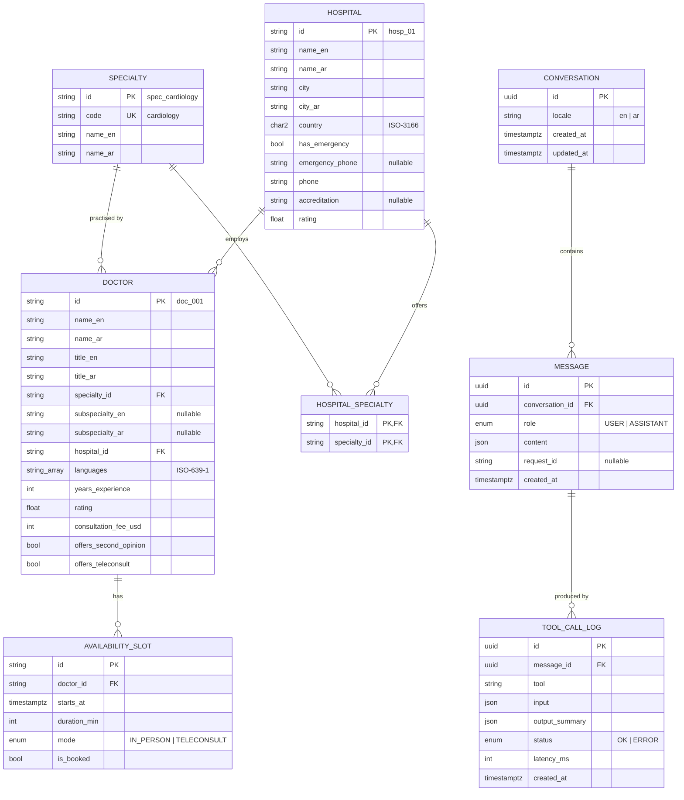

# Database

PostgreSQL, accessed through **Prisma 7** (`prisma-client` generator + `@prisma/adapter-pg` driver adapter).
Schema: [`apps/api/prisma/schema.prisma`](../apps/api/prisma/schema.prisma) · Migrations: [`apps/api/prisma/migrations`](../apps/api/prisma/migrations) · Seed: [`apps/api/prisma/seed-data.ts`](../apps/api/prisma/seed-data.ts)

The data falls into two groups:

| Group                     | Tables                                                                              | Who writes       | Who reads                            |
| ------------------------- | ----------------------------------------------------------------------------------- | ---------------- | ------------------------------------ |
| **Catalog**               | `specialties`, `hospitals`, `hospital_specialties`, `doctors`, `availability_slots` | Seed script only | Agent tools (read-only), catalog API |
| **Conversations & audit** | `conversations`, `messages`, `tool_call_logs`                                       | Chat API         | Chat API, reviewers / debugging      |

## ERD



## Design decisions

- **The agent only sees IDs.** The agent never invents an entity by name. It references doctors and hospitals only by the IDs that tools returned. Catalog IDs are short and prefixed (`doc_014`, `hosp_03`) instead of UUIDs for two reasons:
  1. LLMs copy short tokens more reliably.
  2. The prefix lets the grounding validator reject a hospital ID placed in a doctor field.

  Conversations use UUIDs because session IDs must be unguessable.

- **Bilingual columns.** The catalog uses `*_en` / `*_ar` column pairs instead of a translations table. There are two fixed languages, so this keeps queries simple. With more locales, a translation table would scale better.
- **`hospital_specialties`.** This join table tracks which specialties a hospital offers, independent of which doctors are listed. For example, a hospital search for "emergency + cardiology" doesn't depend on a doctor row existing.
- **Typed, constrained values.**
  - Fees are integer USD; floats are never used for money.
  - Timestamps are `timestamptz`.
  - Country is `char(2)`.
  - Enums are Postgres enums.
  - Search columns are indexed: `(country, city)`, `specialty_id`, `hospital_id`, `(doctor_id, starts_at)`.
- **Audit trail.** `tool_call_logs` records every tool invocation behind an assistant message: tool name, validated input, compact output summary, status, and latency. This shows why the assistant recommended something. Only summaries are stored (returned IDs and counts), never full patient text.
- **`messages.content` is JSON.** Assistant messages store the validated structured response (the shared `ChatResponse` contract), not free text. The UI can re-render history exactly as it was shown.

## Seed data

The seed contains 8 specialties, 6 hospitals in 3 cities, 19 doctors, and about 640 availability slots. It is **entirely fictional**. It is shaped so the core scenarios are testable:

- Chest pain: every city has at least one hospital with an emergency department, and at least one cardiologist who offers second opinions. This is enforced by [`seed-data.spec.ts`](../apps/api/src/database/seed-data.spec.ts).
- Filtering: languages, fees, teleconsult and second-opinion flags vary, so filters have something to filter.
- Availability is deterministic and relative to the time the seed runs: always 14 days ahead, in UTC. Re-run the seed to refresh the slots.

The seed is idempotent. One transaction replaces the catalog tables and never touches conversation data.

## Commands (from repo root)

```bash
pnpm --filter @healtrip/api db:local     # optional: local Postgres without Docker (prints DATABASE_URL)
pnpm --filter @healtrip/api db:migrate   # apply migrations (prisma migrate deploy)
pnpm --filter @healtrip/api db:seed      # load mock catalog
pnpm --filter @healtrip/api db:studio    # browse data
```
