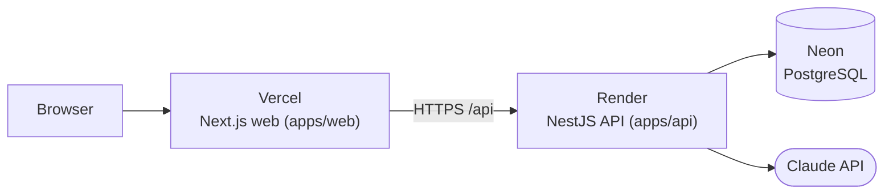

# Deployment

| Piece            | Platform                          | Config in repo                                    |
| ---------------- | --------------------------------- | ------------------------------------------------- |
| Web (`apps/web`) | Vercel (Next.js)                  | [`apps/web/vercel.json`](../apps/web/vercel.json) |
| API (`apps/api`) | Render web service (Node 22)      | [`render.yaml`](../render.yaml) (Blueprint)       |
| Database         | Neon PostgreSQL                   | migrations in `apps/api/prisma/migrations`        |
| Model            | Anthropic API (`claude-opus-5-5`) | `LLM_*` environment variables                     |

## Environment

| Where  | Variable                                                                                              | Value                                                                 |
| ------ | ----------------------------------------------------------------------------------------------------- | --------------------------------------------------------------------- |
| Render | `DATABASE_URL` (secret)                                                                               | Neon connection string, `?sslmode=require`                            |
| Render | `ANTHROPIC_API_KEY` (secret)                                                                          | Anthropic API key                                                     |
| Render | `CORS_ORIGINS` (secret)                                                                               | The Vercel URL, e.g. `https://healtrip-ai-assistant.vercel.app`       |
| Render | `LLM_PROVIDER`, `ANTHROPIC_MODEL`, `LLM_EFFORT`, `LLM_DAILY_TOKEN_BUDGET`, `NODE_ENV`, `NODE_VERSION` | Preset by `render.yaml`                                               |
| Vercel | `NEXT_PUBLIC_API_URL`                                                                                 | The Render URL + `/api`, e.g. `https://healtrip-api.onrender.com/api` |

The web app bakes `NEXT_PUBLIC_API_URL` in at build time, and the API only accepts browser requests
from `CORS_ORIGINS` — so the order is: **database → API → web → set `CORS_ORIGINS` → redeploy the API**.

## Steps

1. **Neon** — create a project (region close to Frankfurt, e.g. `eu-central-1`) and copy the connection string.
2. **Render** — _New → Blueprint_, select the repository. Fill in `DATABASE_URL`, `ANTHROPIC_API_KEY`,
   and a temporary `CORS_ORIGINS` (e.g. `https://example.com`). The build installs, builds, applies the
   migrations and seeds the catalog (the seed is idempotent and refreshes availability on every deploy).
3. **Vercel** — _Add New → Project_, import the repository, set **Root Directory = `apps/web`**
   (install/build commands come from `vercel.json`), add `NEXT_PUBLIC_API_URL`, deploy.
4. **Render** — set `CORS_ORIGINS` to the Vercel URL and redeploy.
5. **Check** — `scripts/smoke-deployed.sh <render-url>/api <vercel-url>`.

## Cost and abuse controls

- **Daily token budget** (`LLM_DAILY_TOKEN_BUDGET`, default in the Blueprint: 1.5 M tokens ≈ 75 patient
  messages): usage is counted per UTC day in the `llm_usage_daily` table; past the budget the offline
  demo brain answers until midnight UTC, so the demo keeps working and the bill is bounded.
- Per-client rate limits (60 requests/min, 10 chat messages/min), 30 messages per conversation, and at
  most 6 model calls / 90 s per message.
- Also set a monthly spend limit on the Anthropic account (defense in depth).

## Operational notes

- Render's free plan sleeps after ~15 minutes idle; the first request then takes ~50 s (the web app
  shows "Checking your situation…" and has a 100 s timeout).
- Migrations run in the build (`prisma migrate deploy`): forward-only and safe to re-run.
- Liveness `GET /api/health` (Render health check), readiness `GET /api/health/ready` (database).
- Logs are structured JSON with a request ID per request and no patient text.
